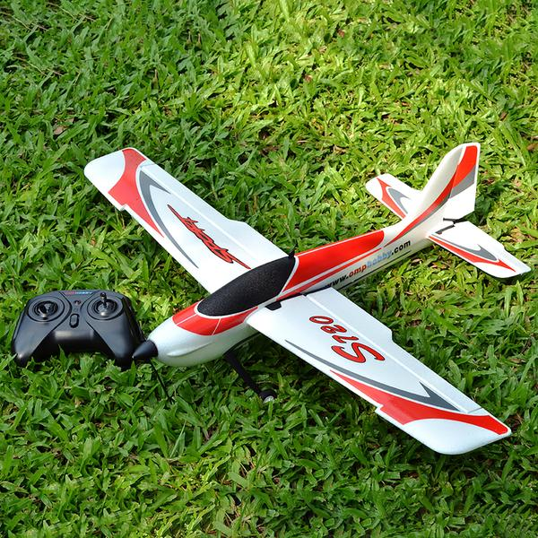
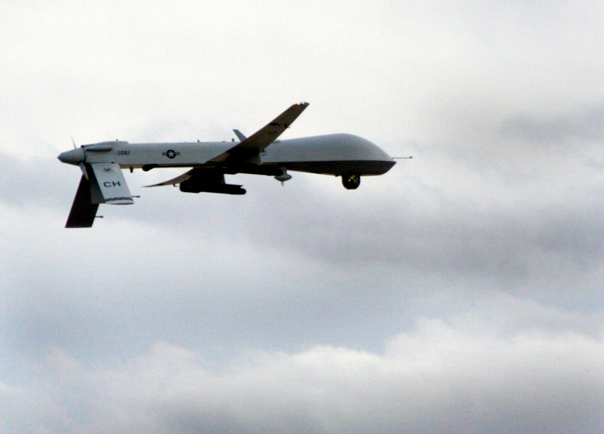
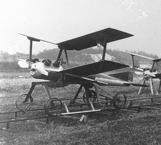
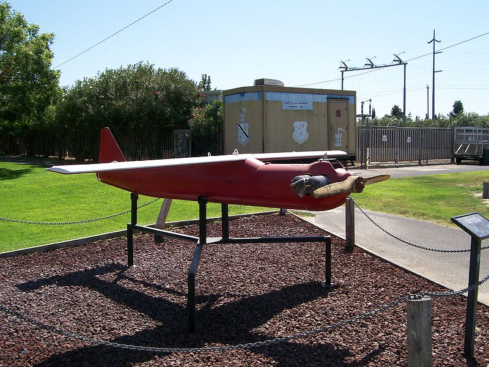
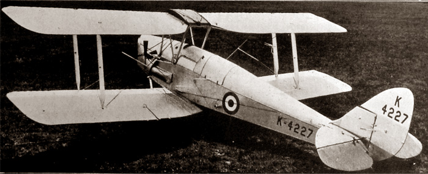
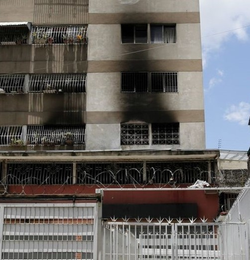

--- 
title: "ME143 - Unmanned Aircraft Systems"
author: "Dr. Brandon Stark"
date: "`r Sys.Date()`"
site: bookdown::bookdown_site
documentclass: book
bibliography: [book.bib, packages.bib]
biblio-style: apalike
link-citations: yes
description: "Course material for ME143"
---

# Course Information

This is the course lecture material for UC Merced ME143.  All course assignments, exams, quizzes and the syllabus can be found in Catcourses.

For information on how to compile or edit the course material, please visit the github repository.

```{r ucmheart,echo=FALSE, out.width='50%', fig.asp=.75, fig.align='center'}
knitr::include_graphics('images/general/UCM_heart.jpg')
```

This page was published using **bookdown**[@R-bookdown] using RStudio in R Markdown and **knitr** [@xie2015].  The raw files can be found in the corresponding github page here: https://github.com/UCM-ME143/UCM-ME143.github.io

<!--chapter:end:index.Rmd-->

# Introduction {#ch-intro}

Introduction to UAS

**Daily Show with Jon Stewart (January 2013) - Interview with Missy Cummings - Rise of the Drones**

- http://www.cc.com/video-clips/87aevs/the-daily-show-with-jon-stewart-exclusive---missy-cummings-extended-interview-pt--1?xrs=share_copy_email
- http://www.cc.com/video-clips/rwkvkp/the-daily-show-with-jon-stewart-exclusive---missy-cummings-extended-interview-pt--2
- http://www.cc.com/video-clips/91upnm/the-daily-show-with-jon-stewart-exclusive---missy-cummings-extended-interview-pt--3


## Language and Terminology

```{definition, defUA, name="Unmanned Aircraft"}
A drone, remote-controlled pilotless aircraft, or a human-designed device that is used to intended to be used for flight in the air that is operated without the possibility of direct human intervention from within or on the aircraft.

```

```{definition, defUAS, name="Unmanned Aircraft System"}
An unmanned aircraft and all of its associated elements (including communication links and the components that control the small unmanned aircraft) that are required for the safe and efficient operation of the unmanned aircraft.

```

```{definition, defSUA, name="Small Unmanned Aircraft"}
An unmanned aircraft that weighs less than 55 lbs on takeoff, including everything that is on board or otherwise attached to the aircraft.

```

```{definition, defSUAS, name="Small Unmanned Aircraft System"}
A small unmanned aircraft and its associated elements (including communication links and the components that control the small unmanned aircraft) that are required for the safe and efficient operation of the small unmanned aircraft.

```

```{corollary, defMA, name="Model Aircraft"}
In the current regulatory framework, there is no definition of a model aircraft or legal distinction between the flying toy you buy at Walmart, the RC plane from the hobby store or a 30 lb industrial drone.  All are considered Unmanned Aircraft. 

```

Unmanned Aircraft refers to just to the object that flies, but is usually only used when there is a need to make a distinction.  The same with small UAS (sUAS) and UAS - it's usually only used when there needs to be an explicit distinction between drones under 55 lbs and those that are heavier than 55 lbs.

### Some examples of Unmanned Aircraft Systems

```{r quad, fig.cap='A regular quadrotor design', echo=FALSE, out.width='50%', fig.asp=.75, fig.align='center'}
knitr::include_graphics('images/general/quadrotor.jpg')
```

```{r rcplane, fig.cap='A remote control plane (rc plane)', echo=FALSE, out.width='50%', fig.asp=.75, fig.align='center'}

```

```{r militarydrone,echo=FALSE, fig.cap='A military drone', out.width='50%', fig.asp=.75, fig.align='center'}

```

### Some other names of drones

UAV - unmanned aircraft vehicle

UAS - unmanned aerial system

RPAS - remotely piloted aircraft system 

- Commonly used internationally

Multi-rotor and similar terms

 - quadrotor, quadcopter
 - hexirotor, hexicopter
 
> Helicopter is derived from 'helico' (spiral/whirl) and 'ptero' (wing as in pterodactyl) from Greek.  Despite it's common use, 'copter' isn't actually a valid suffix. Even worse, 'quad' is a Latin prefix.  So when you say 'quadcopter' you're mixing a Latin prefix with a mangled Greek suffix.  Truly an American English word. 

### Common Drone Manufacturers

- DJI - (Da-Jiang Innovations) - https://www.dji.com/
    - Probably the most well-known and ubiquous non-military drone company
- Sensefly - Parrot Group - https://www.sensefly.com/
    - Most known for their eBee foam fixed-wing drone for mapping operations

## History

A short timeline of notable UAS history

- The first "claimed" heavier-than-air, powered flight was of a UAS over the Potomac River, by Dr. Sam Langley (1896)
- The first radio-controlled UAS flights were converted Navy trainers, flown over Long Island using the recently invented automatic gyroscopic stabilizer (1917)
- The first mass production UAS was the Kettering Bug, costing $400 and capable of carrying a 300 lb (1918) - History Channel clip - https://youtu.be/gNO84yh2ZxY 
- The British Queen Bee UAS was landed by dragging a weighted antenna line on the ground, which then pulled back the stick and the throttle to become the first re-usable UAS (1935)
- Reginald Denny (actor and model aircraft enthusiast) signed a contract with the Navy to deliver TDD-1 (Target Drone Denny 1) in 1939
    - The first recorded instance of 'drone' being associated with a UAS

### Drones as Guided Missles

The [Kettering Bug](https://en.wikipedia.org/wiki/Kettering_Bug) is regarded as one of the very first mass produced drones - but it's also known as one of the first 'guided torpedoes.'  It was practically a bomb with an engine and wings to give it flight.  But nonetheless, it was equipped with a rudimentary inertial control system that kept it stabilized in flight.  After a preset number of engine revolutions, the engine would shut down and let the bomb fall. 

```{r kbug,echo=FALSE, fig.cap='Kettering Bug', out.width='50%', fig.asp=.75, fig.align='center'}

```

With no way to control the Kettering Bug after launch, they had limited value and were deployed too late in WWI to be of value.  

### Drones as Target Practice

However, after the Kettering Bug, new advances in radio control allowed for remotely controlling an aircraft in flight.  It was finally with these advances that drones became instrumental in the changing shape of warfare.  

>The British Royal Air Force was in a debate with the Royal Navy over the ability of an airplane to sink a ship. In the early 1920s, General Billy Mitchell of the Army Air Corps sunk a war prize German battleship and subsequent older target warships to the dismay of the U.S. Navy. The counterargument to these demonstrations was that a fully manned ship armed with antiaircraft guns would easily shoot down attacking aircraft. The British used unmanned target drones flown over such armed warships to test the validity of the argument. In 1933, to the surprise of all, a target drone flew over 40 missions above Royal Navy warships armed with the latest antiaircraft guns without being shot down.

Demonstrations like the above quickly demonstrated two issues: 1) the value of air superiority and 2) the need for anti-aircraft weaponry training.  Drones as one-time targets, such as the TDD-1 and [OQ-2 Radioplane](https://en.wikipedia.org/wiki/Radioplane_OQ-2) were instrumental in preparing for WW2.

```{r KAQ,echo=FALSE, fig.cap='Kawasaki KAQ-1 - A rare 1950s era target drone on display at the Castle Air Museum', out.width='50%', fig.asp=.75, fig.align='center'}

```


>**Where does the term 'Drone' come from?** The origins of the term 'Drone' is lost to history, but the first recorded use is from 1939 - Target Drone Denny-1.  However, there is precident for naming aircraft after insects (1929 Gipsy Moth) and the [1935 Queen Bee](https://www.dehavillandmuseum.co.uk/aircraft/de-havilland-dh82b-queen-bee/) was the first returnable and resusable drone used for target practice.  This relationship lends credance to the term 'drone' being so named as a reference to worker bees.


```{r QueenBee,echo=FALSE, fig.cap='The DeHavilland DH-82B Queen Bee  ', out.width='50%', fig.asp=.75, fig.align='center'}

```

### Modern Drones

Currently, we now think of drones as what you saw in Figures \@ref(fig:quad) and \@ref(fig:militarydrone).  Either as these small quadrotor toys or large military weapons.  But there's surprisingly not that large of a difference between the two.  

```{r venAssassin,echo=FALSE, fig.cap='Assassination Attempt', out.width='80%', fig.asp=.75, fig.align='center'}
knitr::include_graphics('images/history/Venezuela1.jpg')
```

This was a relatively high-profile assassination attempt of the Venezuela President in August 2018.  While there remains questions about the legitimacy of the attack, the drone and the explosion were real.  This wasn't a military drone - this was a DJI Matrice 200 that was loaded with 2 lbs of explosives.  

```{r venAssassin2,echo=FALSE, fig.cap='Scorched Building from Drone Assassination Attempt', out.width='80%', fig.asp=.75, fig.align='center'}

```


## Pop-Culture


<!--chapter:end:01-intro.Rmd-->

# Regulations

## US Regulations

## Airspace Charts

## Issues and Controversies


<!--chapter:end:02-regulations.Rmd-->

# (PART) UAS Modeling and Control {-}

# UAS Dynamics

## Fixed-Wing Models

## Rotary-Wing Models

We describe our methods in this chapter.

<!--chapter:end:03-dynamics.Rmd-->


```{r include=FALSE}
# automatically create a bib database for R packages
knitr::write_bib(c(
  .packages(), 'bookdown', 'knitr', 'rmarkdown'
), 'packages.bib')
```


`r if (knitr::is_html_output()) '# References {-}'`

<div id="refs"></div>

<!--chapter:end:references.Rmd-->

# (APPENDIX) Appendix {-}

# Digital Systems

# Vector Notation

<!--chapter:end:appendix.Rmd-->

